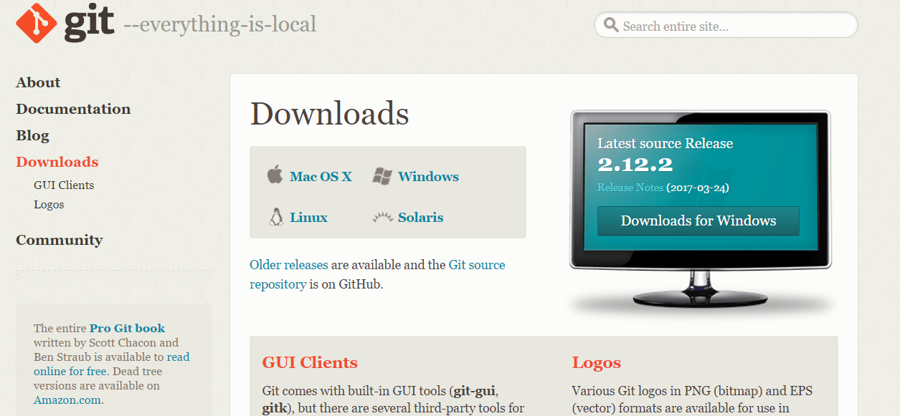
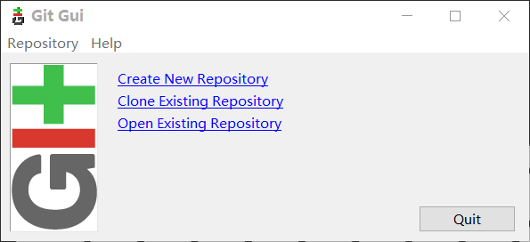
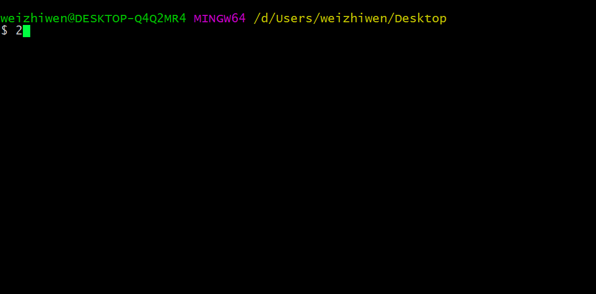

# 
git的入门使用

### 1.什么是git
git可以说是一个快速的版本控制系统，是一个帮助我们记录我们文件文档的历史的工具，并且可以回溯到历史的任何一个版本，更重要的是可以多人协同对一个项目进行开发。

### 2.git和github
github是一个全球性的开源和私有的托管平台，可以为你提供免费的仓库存放你的文档或者代码，是基于git做的一个项目托管平台。简单的来说，我们可以通过git这个工具来给github平台上的仓库增加”货物“、拿走”货物“、替换货物“、查看”货物“等等，并且还可以和大家分享你的”货物“（放心你的货物不会少的:smiley:）。直接在github平台上的仓库上操作功能是有限的，所以我门要借助git这个工具来帮助我们完成各种我们需要的功能。你像是一位仓库老板，而git就像是仓库的管理员，可以记录货物的进仓，出仓以及更改，并且可以找回仓库历史的货物，是不是很神奇？这也就是为什么我们要用git这个工具了，当然也有其他的工具，这里只说git的使用。

### 3.git本地仓库和github远程仓库
git更多的是在本地工作，也就是离线的，此时不需要联网，只需要建立一个本地的仓库，而github平台上的仓库可以看作是远程的仓库，所以我们在本地仓库把货物装好后，在”运输“到远程的github上的仓库。我们平时的操作是对于本地仓库的，也就是版本库git，当我们想把货物放到远程仓库时，我们就需要和我们的github平台上的仓库建立联系，怎么建立联系呢？重要的一点就是联网。你可能会问，在我的本地仓库上放到好好的货物，为什么要放到远程仓库呢？首先你的本地仓库没有远程仓库安全，并且本地仓库是要占用你的磁盘空间的，假如哪一天这个仓库被破坏了，比如说被你误操作销毁（删除）了，在想找回这个仓库中的”货物“就是很难的了。再者你的仓库是固定的，你不能很方便的带着，也不能很好的分享给别人，这时候远程仓库就派上用场了。只要有网络，你就可以去github网站上把你仓库中的”货物“拿出来一份，你的远程仓库里面的”货物“是不会少的，就相当于是复制了一份，是不是很方便呢？并且如果你指定这个远程仓库是公开的（就是开源），也就是任何人都可以复制一份你的仓库中的”货物“。当然别人公开仓库中的货物，你想要的话也可以免费得到，这样大家就可以互相分享，也就是现在的流行精神——”开源精神“。为什么说github是一个平台，而不是说它是一个远程仓库呢？因为你可以给你不认识的人的仓库贡献一些有用的货物，或者发现一些有害的”货物“。这就是平台的功能了，具有一些社交属性，可以在这里交到一些朋友哦，有些人还是很厉害的，因为是全球性的，外国人也是很有可能的，想想就兴奋对吧。

### 使用git
git是一个工具，需要先下载，:point_right: [git的官网](https://git-scm.com/downloads),下载对应你操作系统的git软件即可。  
  
安装这里就不说了，下面操作是以windows操作系统说明的。和安装普通软件一样，安装好git后，git工具会自动给你添加到鼠标右键功能，一个是Git GUI Here和Git Bash Here。git为我们提供了两种管理仓库的方式：一种是图形化的，也就是Git GUI Here选项，如下图一，另一种是命令行的，也就是Git Bash Here选项。如下图二。  

图一

图二

图形化的操作是比较简单的，但这里我们讲述命令行的方式，因为这种方式的功能更强大。
