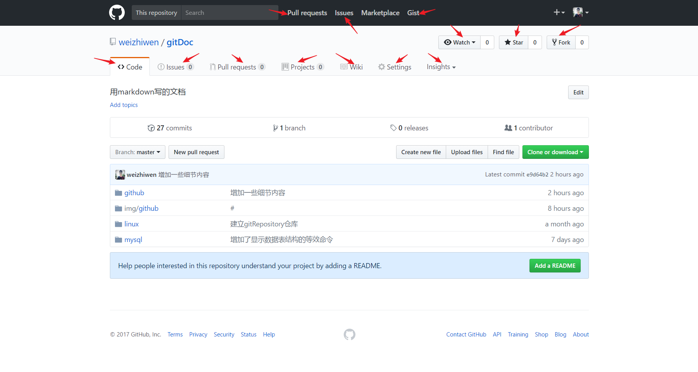

# 初始github

<a href="http://www.baidu.com">百度</a>
[百度](http://www.baidu.com)
## 目录
- 1.[Github是什么](#1-github是什么) 
- 2.[Github可以做什么](#2-github可以做什么)
- 3.[注册Github账号](#3-注册github账号)
	- 3.1[Step 1](#31-step1)
	- 3.2[Step 2](#32-step2)
	- 3.3[Step 3](#33-step3)
- 4.[Github网站的介绍](#4-github网站的介绍)
	- 4.1[用户信息的修改](#41-用户信息的修改)
	- 4.2[网站上专有名词的说明](#42-网站上专有名词的说明)

## 1 Github是什么
[Github的百度百科](http://baike.baidu.com/link?url=WDFA0PF6QxWuccDtdEZGIbtDZx5KN45Ei-MFKc_qjkFDP58IpJUW5r8P7hbISWPF7Me4tzsIjsBTflj4u55KfK) 

首先Github是一个平台，主要用网站的方式展现，当然也有github桌面版的软件，也有手机App。Github是一个面向开源和私有项目的托管平台，具有版本控制和协作代码管理的功能。有了账号后，可以在平台上建立自己的仓库，Github上主要是程序代码仓库，当然还可以有其他的使用。

## 2 Github可以做什么
上面说到Github具有版本控制的功能，版本控制就是一个项目随着逐渐的完善，会有不同的版本，比如手机QQ，时不时的会更新一下，增加新的功能，细心观察的小伙伴会发现QQ的版本号每次更新都会不一样。如果每个版本都要保存一份，想想需要保存多少的版本，并且还要多处备份避免丢失，麻烦不麻烦，累人不累人。但如果你的项目放到了Github上，那一切将会变得轻松，每次你的项目有变更，你都可以在Github上添加一次记录，并还可以对比本次和上次内容的差异，如果你想回到之前的版本也是很简单，神奇不神奇，具体的操作以后会说，现在只需先有个概念。

另外Github还有协作代码管理的功能，在团队协作开发项目的时代，如何更好的合作来完成项目就显得异常重要。Github把一个项目分支，主分支是master，一个团队的每个人就是一个小分支，大家先在自己的分支上工作，为主分支提供自己的贡献，团队的负责人再把小分支合并到主分支上，最后可以项目发布主分支。在项目合作的过程中，每个人负责的部分是不一样的，如果按传统方法则需要有个工作先后顺序，而有了Github，大家可以同时工作而不受影响，最后要做的工作不过是合并大家的成果而已，这样项目开发的效率就大大提高了，并且还避免了对主分支的错误操作，使项目开发省时省力。

Github能做的还不止这些，Github也像是一个社区，大家可以在这里贡献自己的聪明才智，去帮助其他的人，比如说分享自己的代码文档资料等等。另一方面你也可以免费得到他人开放分享的资源，来提升自己，当然他人的项目中可能会存在问题，你可以向项目人提交你发现的问题甚至提出自己的修改方法，项目人收到你的问题后可以进行更改或者采纳你的修改方法。每个人都可以为这个社区贡献自己的一份力量，这样就会进入一种良性循环，从而让社区的每个人都从中受益。这个社区还有一些人开展的开源项目，如果你有能力或者建议可以与他们合作开发，可以成为项目的一份子，从而提升自己的能力和人脉。由于Github是全球性的，所以在这里结交到外国朋友甚至收到外国人提供的工作也不令人惊讶。

对于程序员来说，在项目开发中，可以直接借助他人已经做好的“轮子”（如第三方的代码库，你可以直接导入自己的项目，并且按照使用案例来使用）来更快的开发自己的项目。Github上的大牛很多，他们开源的项目，你都可以按照项目中的规定使用，当然在自己的项目使用别人的智慧，最好给个声明来表示对人家的衷心感谢。

关于Github的使用，其实可以用它来做个人网站，博客，或者是写个人简历。但Github也还有一些奇特的用法，:smile:曾经看到过一个人用它来写小说，也是够可以的，还有一个妹子把自己找男票的条件放在上面，但她好像并没有找到男票:smiley:，使用Github的大多数还是程序员。但只要你敢想敢做，你还以发掘Github的其他用处。

## 3 注册Github账号 
既然Github有这么多的好处，你是否也想探索你的Github之旅呢？那么就随我一起开启自己在Github上的征程吧！

- 登录Github官网 :point_right: [Github官网](https://github.com/)

- 创建Github账号 [加入Github](https://github.com/join?source=login) :point_left:

- ### 3.1 Step1
按照网站上的要求，填写姓名，注册邮箱，密码信息就可以注册账号啦！注意要进行验证，在用邮箱注册后Github会给你发一份邮箱验证邮件，需要点击验证链接 Verify email address 

- ### 3.2 Step2
注册成功后，进入欢迎来到Github界面，选择个人的计划，对于大部分人来说我们都是选择免费的开源仓库类型，之后如果涉及到机密的仓库也可以创建成付费的私人仓库的，所以选择第一个就好了。关于创建一个项目组织的，以后也可以再创建的，就是每个Github用户都可以加入一个组织，当然是前提是要得到组织创建人的同义才可以加入的。

- ### 3.3 Step3
填写一些信息来简单的介绍自己，比如像图片上的，自己的编程经验如何，自己使用Github的计划，自己的身份，自己感兴趣的内容等等。当然你也可以直接跳过这一步，其实Step 1之后你就已经注册完成Github账号了。

最后是Github的初次使用向导，由于github的介绍是英文的，所以下面会详细介绍。

## 4 Github网站的介绍
我们先打开Github的个人主页，这个是我刚注册的Github账号主页，地址：https://github.com/wenshixin ，直接在https://github.com/ 后面加上用户名即可，下面借助页面来逐一介绍页面上的用户个人信息修改以及页面上专有名词的含义。

下面是我当前正在在使用的这个账号的Github主页展示，因为你刚有Github账号，所以页面上的信息没有我的这样丰富。自己已有一个粉丝还是外国朋友，也是有些小激动。:smile:  

- ### 4.1 用户信息的修改
下面就来随我一起更改自己的个人信息吧！点击上面介绍的编辑信息按钮就可以进入编辑信息界面。

- ### 4.2 网站上专有名词的说明

**Repository:**  
在Github上，Repository是仓库的意思，仓库里就是你的项目，一切项目的开始都是先建仓库。

**Star:**  
之前也说Star是给项目点赞的意思，其实也有收藏的含义，你Star过的项目会出现在你的个人主页的Star里，这样方便你之后对这个项目的查找。

**Fork**  
从Fork前面的图标以及词义上，我们就可以大致猜出他有分支的意思，如果你Fork了一个别人的项目，就相当于是在别人的项目上新建了一个分支，你可以随心所欲的改动这个项目，而不会对原有的项目代码结构产生影响，这个Fork操作在之后的Pull requests操作里还会提到。关于分支的概念，在《相守github》中会详细说明的。

**Watch:**  
Watch一个项目就是关注了一个项目，那么这个项目的最新动态都会及时的发送通知提醒给你。

**Gist:**  
如果你没有项目开源，只想分享一些代码片段，就可以用到Gist功能，但是这个好像直接打不开，需要翻墙才能使用。

**Code:**  
显示当前的项目中的目录结构以及文件内容等

**Issues:**  
项目中的问题或者bug，如果一个项目的Issues数量较多，不一定就说明这个项目错误很多，这其实恰恰说明这个项目受到很多人的重视，问题不可怕，可怕的是怕发现问题，怕去解决问题。如果你发现了问题，可以点击Issues选项，然后提出自己的问题，项目的问题解决了，问题的状态就是Close掉了，否则这个问题的状态就是Open。如下图所示。

**Pull requests:**  
 Github上的开源项目，任何人都是可以参与其中的，大家一起参与开发，一起来完善一个项目，这要用Pull requests来完成，需要先Fork一下别人的项目，然后自己可以把项目clone到本地进行修改完善，做好后再提交到自己的Fork的这个Github仓库中，最后就是在这个点击这个仓库的Pull requests选项，把自己的贡献提交个项目人，自己实际是建了一个分支，项目人查看你的修改，并决定是否接受你的Pull requests。如果你的Pull requests被接受了，那么你也算是这个项目的贡献者之一了。

**Projects:**  
可以在本仓库中新增一个项目，这个功能基本没人用到，新增一个项目我会选择新建一个仓库的，所以这个功能了解一下就好了。

**Wiki:**  
这个功能是关于项目说明文档的，一般每个项目Github都推荐建立一个README.md文档来做些项目说明，如果你的项目中有详细的项目文档，就可以使用Wiki功能来把项目说明文档做的更详细，Wiki通过建立词条来说明内容。

**Pulse:**  
pulse是这个项目活跃的汇总，包括该仓库的Pull requests数和Issues数，还有项目的参与程度，提交次数等等，这些都是反映一个项目的受关注度和参与度的指标。

**Graphs:**  
Graphs从字面可以看出是图表，其实就是上面说的Pulse内容的另一种展示方式，

**Settings:**  
如果这个项目是你自己的仓库的，那么你就拥有这个项目所有设置权，如果你是参看者，那么是没有这个Settings选项的。这个选项是对该项目信息的设置，比如项目的重命名，删除项目，关闭项目的Wiki和Issues功能等等，一般情况下我们采用项目的默认设置即可。

