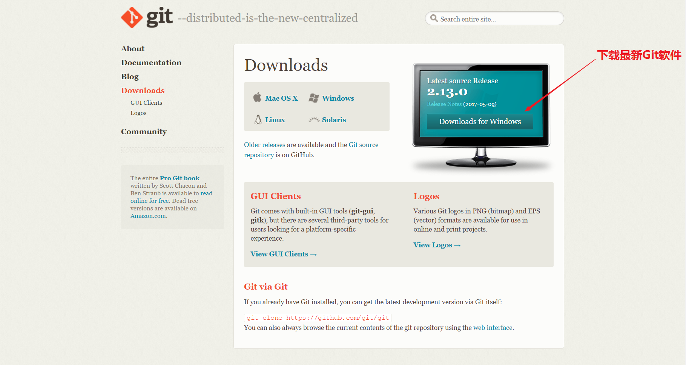
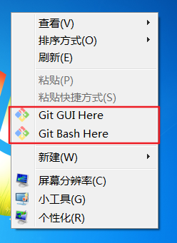
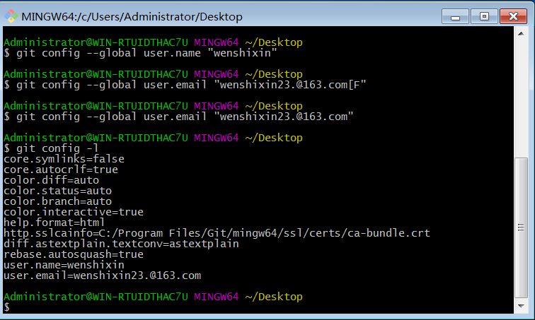
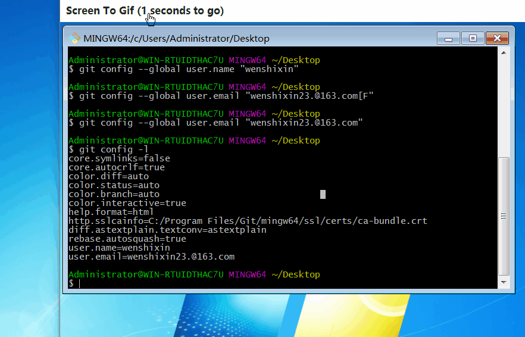
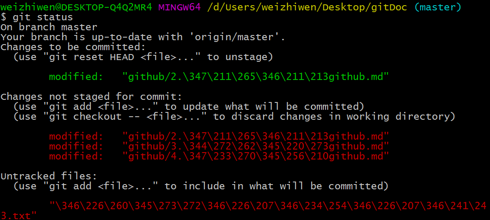
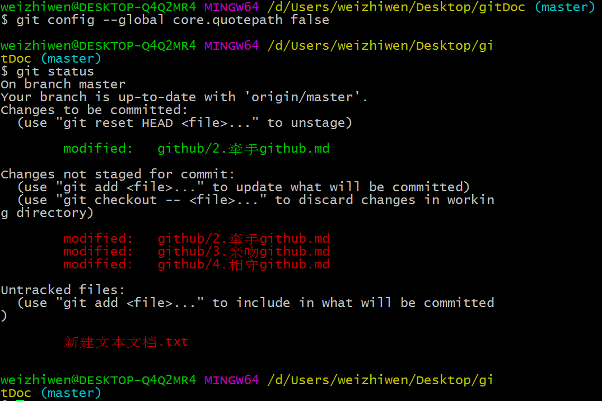
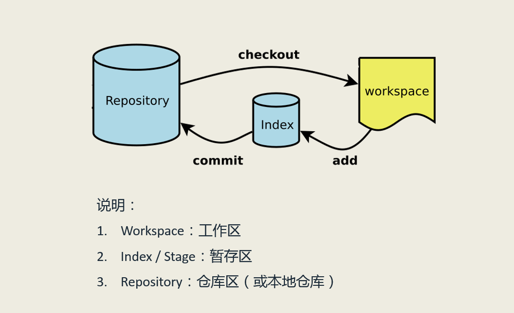
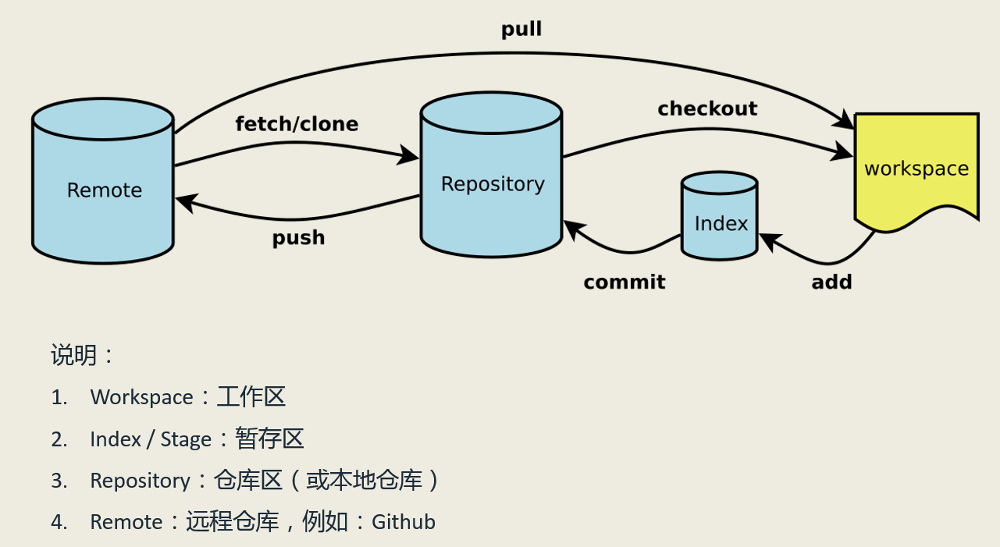

# 牵手Github


## 目录
- 1.[Github和Git的前世今缘](#1Github和Git的前世今缘)
- 2.[Git的下载安装](#2Git的下载安装)
	- 2.1 [Git下载](#21-Git下载)
	- 2.2 [Git安装](#22-Git安装)
- 3.[Git的初始配置](#3Git的初始配置)
	- 3.1 [查看安装的Git的版本](#31-查看安装的Git的版本)
	- 3.2 [查看Git的初始环境变量](#32-查看Git的初始环境变量)
	- 3.3 [配置Git的工作环境变量](#33-配置Git的工作环境变量)
- 4.[Git的工作流程](#4Git工作流程)
- 5.[Git牵手Github](#5Git牵手Github)

## 1.Github和Git的前世今缘
[Git百度百科](http://baike.baidu.com/link?url=UAmMJcx4ZWc9X8Lz2x71e8twXzL--CFO21V716reS38M7HBohE15YeH_5yKZb-hHNad5KMcG34bRiUjCso7psq)

你可能会问学习Github和Git有什么关系吗？首先Github的功能本身就是基于Git来实现。现在的问题是Git是什么？Git是一个开源的分布式版本控制系统，简单的来说就是一个强大的项目版本管理工具，Github因为集成了Git本身的版本管理优点，又加上自身的社区功能，如订阅，讨论，关注，分享代码片段等功能，而Github的功能却又远不止于此！Git是Linux之父——Linus一周写成的（默默崇拜大牛5秒钟），最初是为了帮助管理Linux内核开发而设计的一款免费开源的版本控制软件。（*在这里说一下，开源的意思就是开放源代码，用户可以在此基础上自由使用和修改源代码。*）版本控制工具可不止Git，还有SVN集中式的版本管理方式。但SVN由于设计有缺陷，已经落伍了，Git的设计却被时代所证明正确而接受使用。关于SVN的缺陷问题，不是讨论的重点，可以忽略。Git对于想从事编程行业的来说，已经是必备技能。一句话总结，我们需要用Git来间接操作Github上的仓库，因为Git也可以做到在Github网页上做不到的事，比如说在Github网页上是不能新建一个文件夹的，只能新建一个文件，所以我们需要先在本地上建好文件夹，再用Git推送到Github的仓库中，这样在Github网页上就可以显示文件夹了。另外Git的命令其实比网页上鼠标的点击更高效，学会后使用起来也更方便，这便是Github和Git的前世今缘。

## 2.Git的下载安装
以windows环境下安装为例，Linux和Mac系统请自行查找Git安装资料

- ### 2.1 Git下载
[Git的官方下载地址](https://git-scm.com/downloads)



如果你的下载速度较慢，也可以选择去软件应用中心下载，这里也推荐一个百度软件下载中心，但里面的软件不一定是最新的，还是建议在官网上下载的。[Git百度软件中心下载](http://rj.baidu.com/search/index/?kw=git)

- ### 2.2 Git安装
在windows下Git的安装和常用软件的安装一样，你可以更改安装目录，其他的按照默认的安装选项，直接点下一步直到安装完成即可。安装完成后鼠标的右键会增加两个新的选项。  


## 3.Git的初始配置
- ### 3.1 查看安装的Git的版本  
可以在运行窗口中输入cmd进入命令提示符窗口，然后输入 **```git --version```** 回车即可显示所安装的git版本，也可以进入鼠标右键的Git Bash Here选项进入Git命令行窗口，输入 **```git --version```** 命令来查看版本信息。
- ### 3.2 查看Git的初始环境变量  
在Git Bash窗口中输入 **```git config --global -l //分条查看初始配置信息```**


- ### 3.3 配置Git的工作环境变量 
下面这些环境变量的设置决定了Git在各个环节具体的工作方式和行为。比如说配置使用Git的用户信息，当然不配置也是可以的。
在Git Bash窗口中输入 **```git config --global user.name "wenshixin" //配置用户名```**  **```git config --global user.email "wenshixin23.@163.com" //配置邮箱名```**，再次查看Git的配置信息。


另外还可以配置差异检测工具和Git默认的文本编辑器，一般Git默认的是Vi或者Vim编辑器，这个配置不常用，这里就不多演示，还有一个地方是Git命令行窗口输入的配置，一个是输入光标的设置，一个是在Git里中文显示不正常的设置，鼠标右键点击窗体标题栏。

:star: **中文乱码配置问题**  
如下图所示，在Git里中文是用八进制编码来显示的


通过在Git命令行中输入 **```git config --global core.quotepath false```** ，来修改Git的默认文件编码，使中文文件名正常显示，下图为修改过的中文显示。


## 4.Git工作流程


- ### 4.1 三个区域

工作区，暂存区，本地版本库。  

工作区（workspace）：就是你实际写项目的地方，比如可见的文件夹以及文件  

暂存区（stage/index）：工作区和本地版本库之间的区域，暂存区承担着工作区和版本库之间的“通信”任务，这样的设计为版本控制带来更大的灵活性，工作区的内容先放到暂存区，暂存区会生成索引，或者称为是目录树来记录工作区的修改。由工作区到暂存区只是把工作区的内容做了“跟踪监视”，并没有为其建立版本控制的内容。 

本地版本库（local repository）：暂存区的内容提交到本地的版本库中，版本库有一个 ./git 的隐藏文件夹来管理这个项目的每次提交，至此，你的项目才是真正的被“管理”起来了，而不只是之前的“监控”了。  
关于Git的各种命令，在《亲吻Github》中会详细说到。

- ### 4.2 四种状态 

未跟踪状态（untracked）：文件还只放在工作区，还没有放到暂存区进行跟踪和监视。  
未修改状态（unmodified）：没有进行编辑的空白文件  
修改状态（modified）：对空白文件进行了编辑  
暂存状态（staged）：文件到暂存区的后即为暂存状态

- ### 4.3 Git的各个区之间的工作流程
这三个区域构成一个循环的工作流程，工作区（workspace）的内容添加（add）到暂存区（stage/index）,暂存区的内容再提交到本地版本控制仓库（local repository），工作区又可以切换（checkout）到版本的某一分支。

## 5.Git牵手Github


之前说到可以在Github上创建仓库，这个仓库我们称为是远程仓库（remote repository），这和我们刚才说到的本地仓库又有什么关系呢？从上面的图中我们可以看到这个远程仓库有和本地仓库和工作区有联系。

我们通过创建本地仓库对我们的项目施行了管理控制，但这个仓库毕竟是我们硬盘上的文件，还是会有被意外删除和丢失的可能，所以放到远程仓库就很有必要，放在Github上，我们的项目是放在了Github的国外服务器上，所以有时候在国内访问会有些慢。说明一点，远程仓库也不止Github一家，国内也有 **码云**，**CSDN**，但这些在名气上肯定是比不了Github了，毕竟Github人家是全球性的，这些代码托管平台和Github在使用上其实相差不大。另外远程仓库也提高了我们项目的可携带性，只要在一个连上网的环境，我们就可以从远程仓库拷贝到本地计算机硬盘上，这样也便于分享自己的开源项目，团队合作会在《相守github》中说到的。

知道了这些，我们再来说说Git和Github是如何“牵手”的。本地仓库中的内容可以推（push）到远程仓库，当然这里需要先而让本地仓库和远程仓库建立联系，具体的操作，在《亲吻github》中会说。在本地你可以把远程仓库的内容直接拉（pull）到本地工作区，或者是获取（fetch）和克隆（clone）远程仓库中的内容到本地仓库中，这两种方式的区别，在《相守github》中会说。

