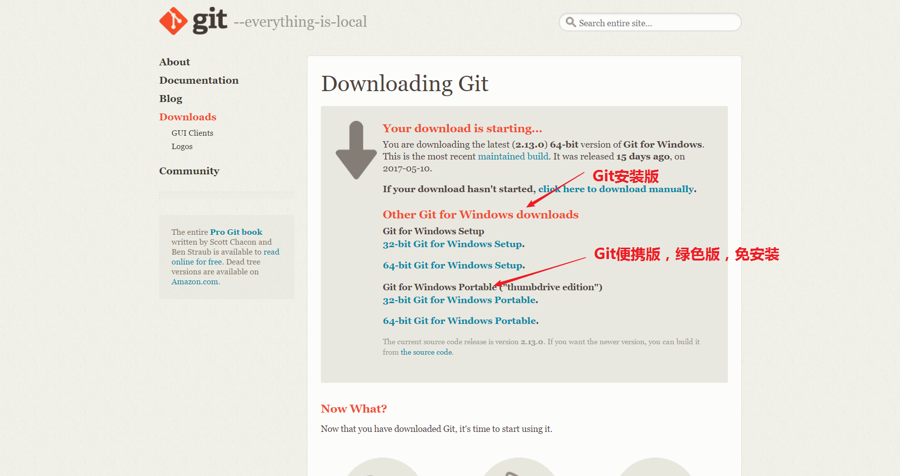
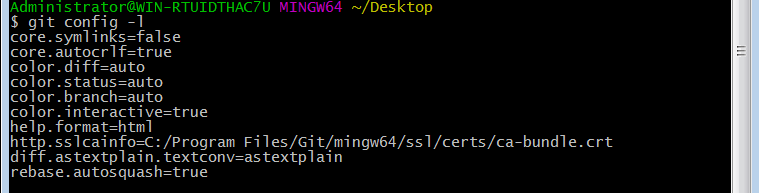

# 牵手Github

## 目录
- 1.Github和Git的前世今缘
- 2.Git的下载安装
	- Git下载
	- Git安装
- 3.Git的初始配置

## 1.Github和Git的前世今缘
[Git百度百科](http://baike.baidu.com/link?url=UAmMJcx4ZWc9X8Lz2x71e8twXzL--CFO21V716reS38M7HBohE15YeH_5yKZb-hHNad5KMcG34bRiUjCso7psq)

你可能会问学习Github和Git有什么关系吗？首先Github的功能本身就是基于Git来实现。现在的问题是Git是什么？Git是一个开源的分布式版本控制系统，简单的来说就是一个强大的项目版本管理工具，Github因为集成了Git本身的版本管理优点，又加上自身的社区功能，如订阅，讨论，关注，分享代码片段等功能，而Github的功能却又远不止于此！Git是Linux之父——Linus一周写成的（默默崇拜大牛5秒钟），最初是为了帮助管理Linux内核开发而设计的一款免费开源的版本控制软件。（*在这里说一下，开源的意思就是开放源代码，用户可以在此基础上自由使用和修改源代码。*）版本控制工具可不止Git，还有SVN集中式的版本管理方式。但SVN由于设计有缺陷，已经落伍了，Git的设计却被时代所证明正确而接受使用。关于SVN的缺陷问题，不是讨论的重点，可以忽略。Git对于想从事编程行业的来说，已经是必备技能。一句话总结，我们需要用Git来间接操作Github上的仓库，因为Git也可以做到在Github网页上做不到的事，比如说在Github网页上是不能新建一个文件夹的，只能新建一个文件，所以我们需要先在本地上建好文件夹，再用Git推送到Github的仓库中，这样在Github网页上就可以显示文件夹了。另外Git的命令其实比网页上鼠标的点击更高效，学会后使用起来也更方便，这便是Github和Git的前世今缘。

## 2.Git的下载安装
以windows环境下安装为例，Linux和Mac系统请自行查找Git安装资料

- Git下载
[Git的官方下载地址](https://git-scm.com/downloads)



如果你的下载速度较慢，也可以选择去软件应用中心下载，这里也推荐一个百度软件下载中心，但里面的软件不一定是最新的，还是建议在官网上下载的。[Git百度软件中心下载](http://rj.baidu.com/search/index/?kw=git)

- Git安装
在windows下Git的安装和常用软件的安装一样，你可以更改安装目录，其他的按照默认的安装选项，直接点下一步直到安装完成即可。安装完成后鼠标的右键会增加两个新的选项。


## 3.Git的初始配置
- 1.查看安装的Git的版本  
可以在运行窗口中输入cmd进入命令提示符窗口，然后输入 **```git --version```** 回车即可显示所安装的git版本，也可以进入鼠标右键的Git Bash Here选项进入Git命令行窗口，输入 **```git --version```** 命令来查看版本信息。
- 2.查看Git的初始环境变量  
在Git Bash窗口中输入 **```git config --global -l //分条查看初始配置信息```**


- 3.配置Git的工作环境变量  
下面这些环境变量的设置决定了Git在各个环节具体的工作方式和行为。比如说配置使用Git的用户信息，当然不配置也是可以的。
在Git Bash窗口中输入 **```git config --global user.name "wenshixin" //配置用户名```**  **```git config --global user.email "wenshixin23.@163.com" //配置邮箱名```**，再次查看Git的配置信息。


另外还可以配置差异检测工具和Git默认的文本编辑器，一般Git默认的是Vi或者Vim编辑器，这个配置不常用，这里就不多演示，还有一个地方是Git命令行窗口输入的配置，一个是输入光标的设置，一个是在Git里中文显示不正常的设置，鼠标右键点击窗体标题栏。


