# 亲吻Github


## 目录
- 1.[Git的基本的命令](#1-git的基本的命令)
- 2.[建立Github上的远程仓库](#2-建立github上的远程仓库)
- 3.[Git和Github相吻](#3-git和github接吻)

## 1 Git的基本的命令

学完这些基础的Git命令，你便就可以一个人在Github上玩耍了。Git的命令上和Linux的命令操作有很多的相同之处，比如文件操作这一块吧，用Git创建文件夹和文件和Linux下命令都是一样的，在Git里面也有和Linux一样的Vim编辑神器，熟悉Linux的话对这个肯定不陌生，但这些都不是要说的重点，简单了解一下即可。下面的Git命令都有一个特点，就是命令的开头都是以git开头的。这些Git命令都是很常见的单词组合，使用过几遍后，记住也是自然而然的事，不信就往下看呗。

- ### ```git init```  
初始化仓库，你可以用Git（再次强调Git只是一个工具）工具把一个项目的文件变成一个有“仓库管理员”的版本控制仓库，仔细观察下面的动态图片，你会发现初始化仓库后，命令行中的路径多了(master)，这就是一个仓库的主分支标志。这条命令后你不会发现你的文件夹里面直接多了什么内容，但实际上这些内容是处于隐藏状态的，是实际存在的，下面是在Git命令行中显示文件列表的操作，**```ls //查看文件夹中的文件列表```** ， **```ls -a //查看文件中的所有文件，包括隐藏文件```** ，./文件夹代表当前的目录，../文件夹代表上一级目录，即父目录。
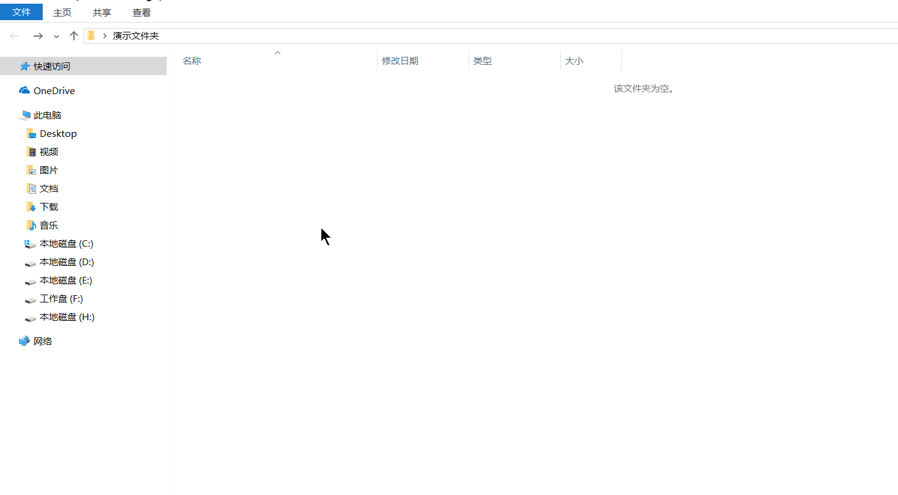

- ### ```git status```  
查看当前仓库的各个文件的状态，这个命令很常用，尤其是刚使用Git的新手，多用这个命令看Git给你的反馈会帮助你更好的理解知识。关于仓库中文件的四种状态，如果记不清可以去看《牵手github》的4.2小节的内容。
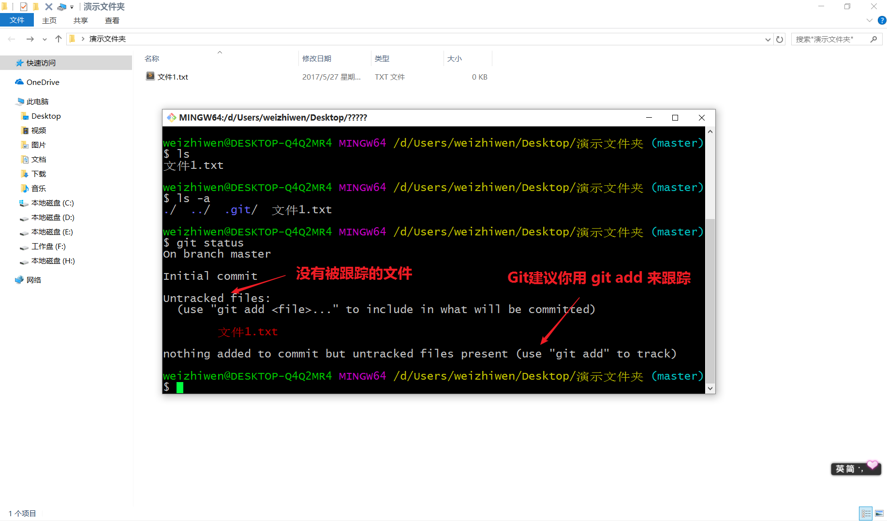

- ### ```git add .```  
**```git add .```** 后面加上一点（.）代表是把工作区的所有文件内容添加到暂存区“跟踪起来”，如果你只想把其中一个文件添加到暂存区，那么只需将（.）换为你的文件名即可。这条命令后你可以在用 **```git status```** 查看一下当前仓库文件的状态，找找下面这张图片和上面这张图片文件状态的区别。
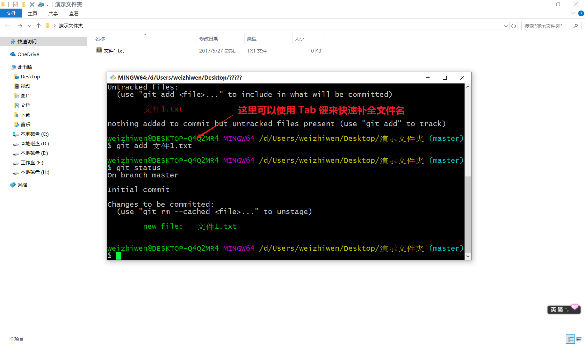

- ### ```git commit -m "提交此次文件的帮助注释"```  
上面的git add命令是把文件放到暂存区跟踪起来了，而这条git commit命令才是真正把文件“控制”起来。
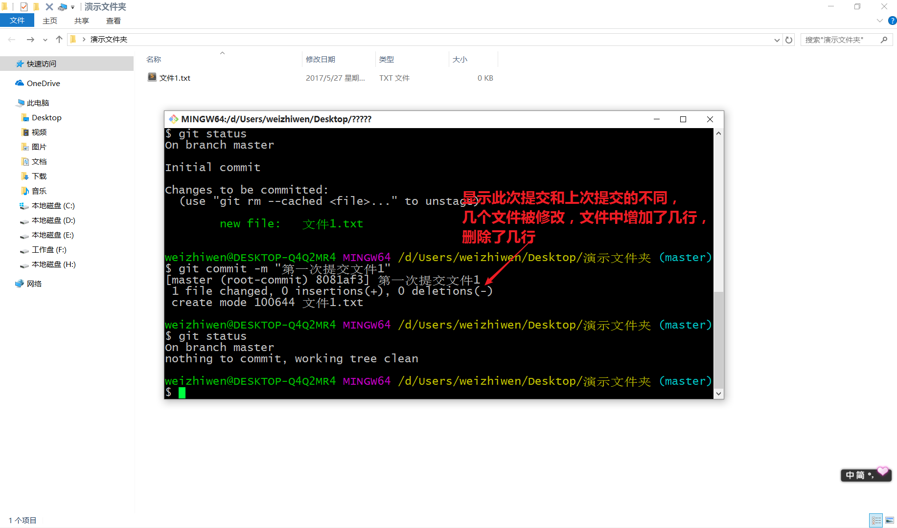

到这里，在你本地仓库的工作就做完了，是不是挺简单的，就这么几条命令而已。下面我们要建远程仓库，又回到我们的Github网站上。

## 2 建立Github上的远程仓库  
-----
通过上面的操作，我们已经有了一个本地的仓库，这时我们要建立一个Github远程仓库了，首先打开我们的Github网站个人主页，打开Repository（仓库），里面就有新建仓库按钮，当然网站上还有其他地方也有可以新建的仓库的按钮。
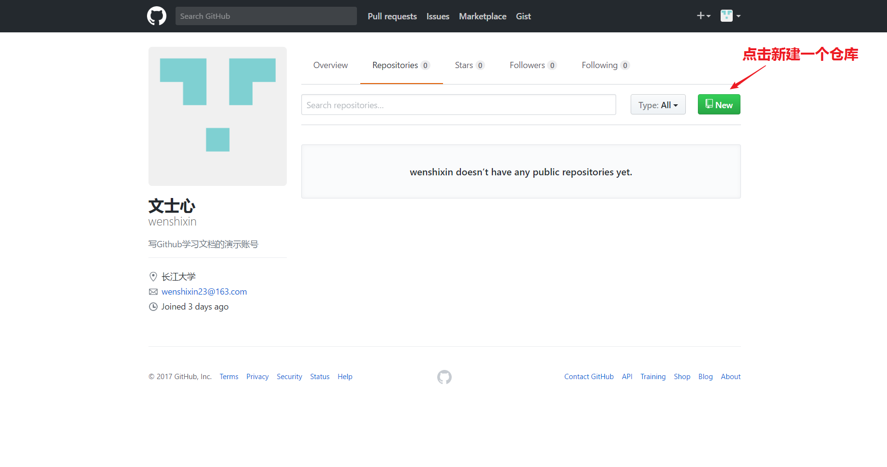
----
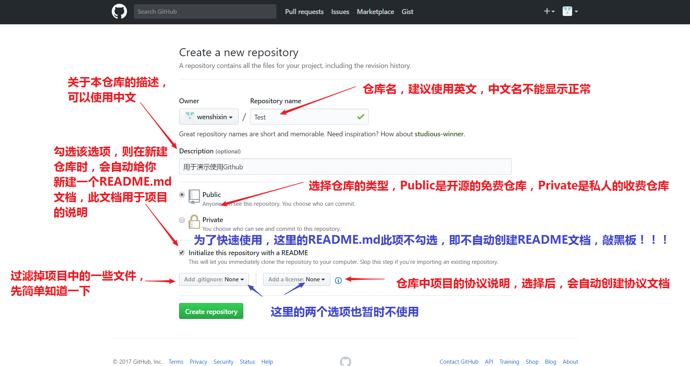

在网络安全中，https是加密传输方式，Github上也使用https来建立本地仓库和远程仓库的联系，这种方式也比较简单常用。但第一次建立联系时，需要输入Github用户名和密码。另一种是ssh密钥方式，ssh采用RSA，即非对称加密，需要先在本机生成ssh的密钥（敲入建立远程连接命令生成），公钥在Github的settings/profile下。使用此种方式本地电脑中存在ssh密钥，就不需要输入Github的用户名密码的身份信息了。但下面都是使用https方式来说明的。
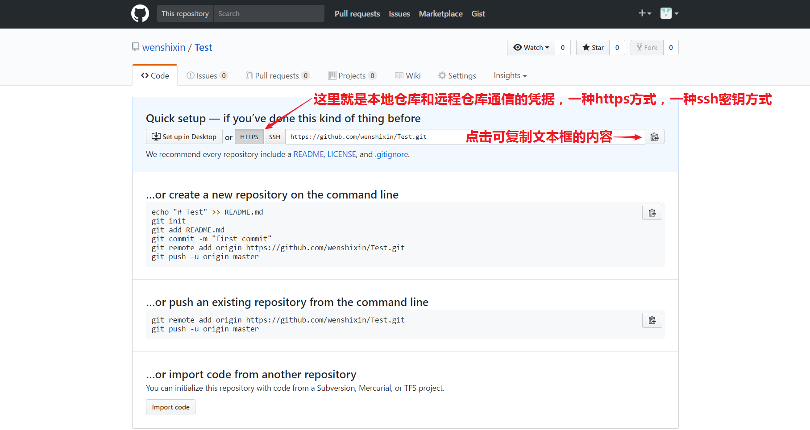

到这里，我们的远程仓库也建好了，下面就开始搞事情啦！:smile:

## 3 Git和Github相吻  
首先开始打开我们的Git bash命令行窗口，origin代表我们的本地仓库，origin后面的https地址就是我们刚才从Github网站复制来的。
- ### ```git remote add origin https://...```  
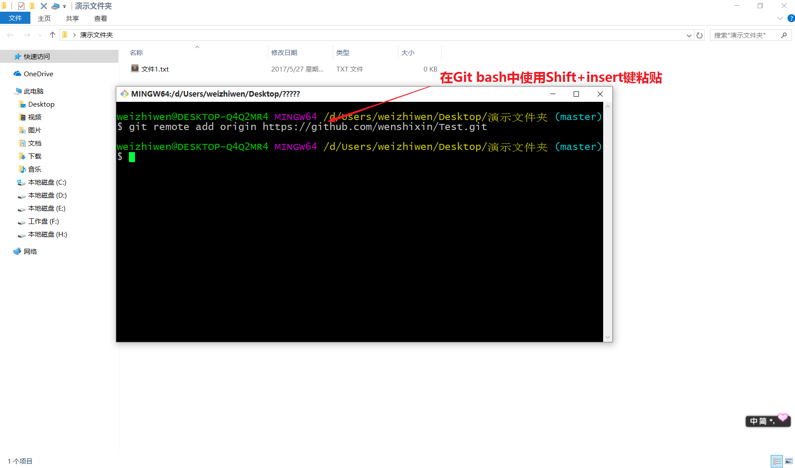

- ### ```git remote -v```  
在linux下，命令执行成功是不会有提示信息的，而报错才会有相应的信息，在Git 的bash命令行里也是同样如此，用这条命令我们就可以查看当前本地仓库和哪个远程建立连接关系。
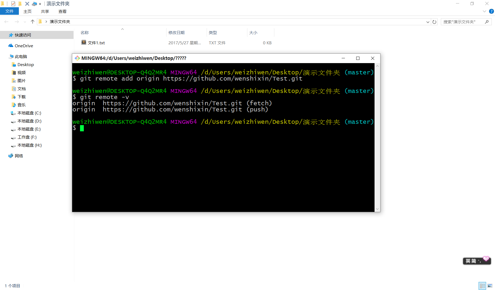

- ### ```git push -u origin master```
-----
通过这条命令，就可以把本地仓库的内容推到远程仓库上去，首次推送，建议加上在push和origin之间加上-u，不加也不会有问题的。其实这条命令很好记，push 推 origin 本地仓库的别名 master主分支。
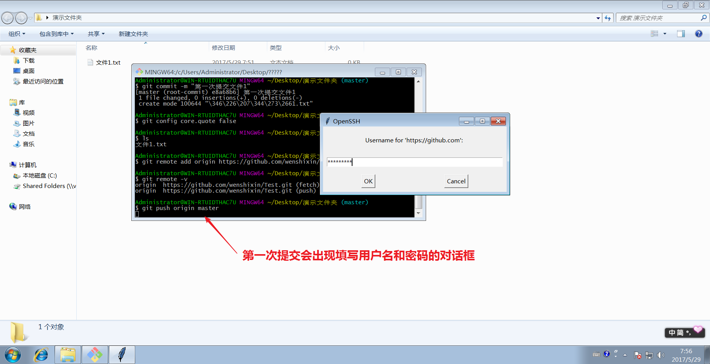
----
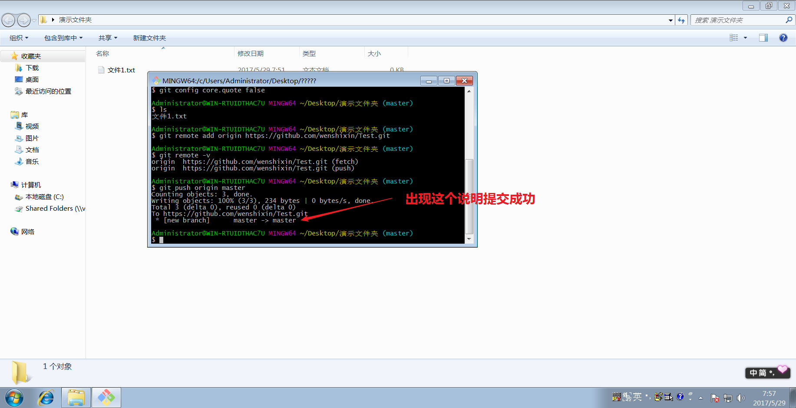

在执行完这条命令后，等待Git把本地仓库的内容提交到远程仓库，刷新一下你的Github网站仓库，看看里面的内容是不是和你本地仓库的一样。
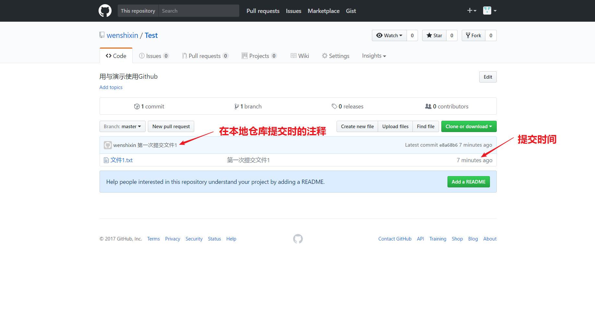

到这里你可以修改本地仓库中的内容，然后在把他们提交到远程仓库上。从这里我们可以看出Git的好处，在没网的时候，我们仍然在我本地仓库可以进行版本控制，而在有网的时候我们再把本地仓库中的内容提交到Github的远程仓库上。想熟练使用Git，就是要多用Git，出现问题是正常的，本文档中的命令都是基本常用的命令，不可能解决使用Git时出现的错误的，有问题可以在网上查查。下面我们在学习常用几个命令吧。

- ### ```git log```    
查看提交的记录，还可以使用```git log --oneline``来查看提交记录的简洁版本，我们还可以用 --graph 选项，查看历史中什么时候出现了分支、合并，这个命令在《相守ghothub》中还会用到。
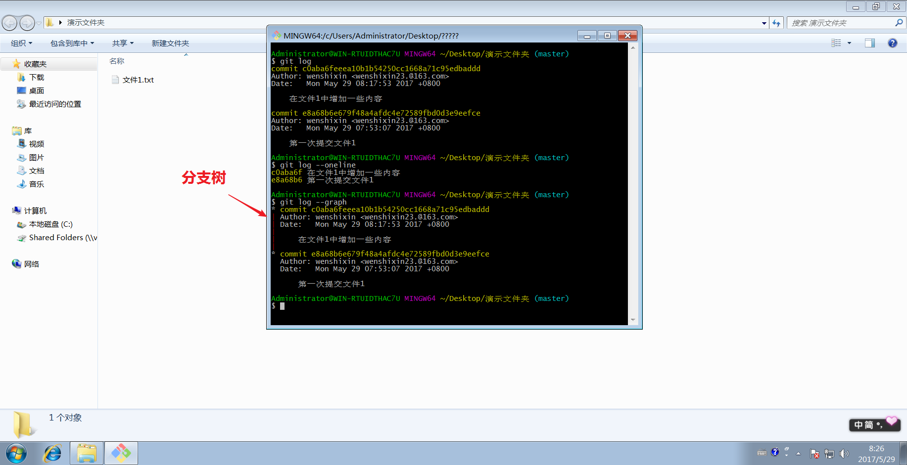

- ### ```git --help```  
----- 
查看所有git的命令用法帮助，另外还可以在git后面的命令加上-h（--help的缩写），来查看这条命令的所有命令用法帮助，比如说git add -h，你也可以试试其他的命令的用法帮助。

----
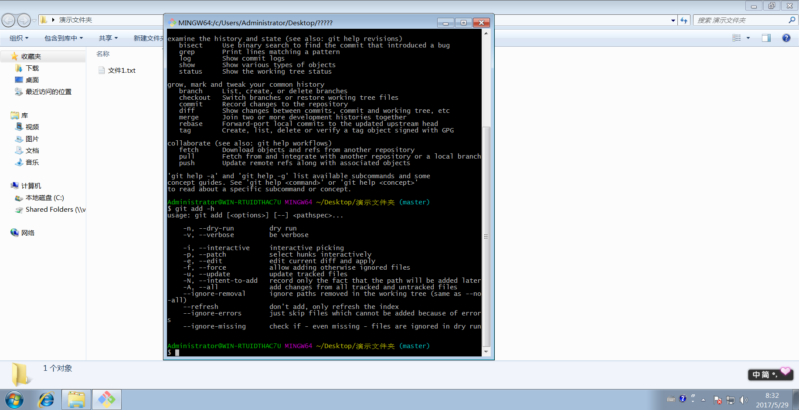
