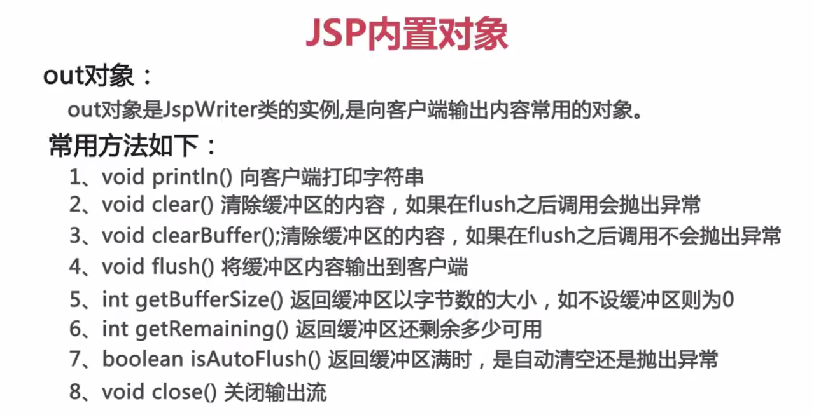
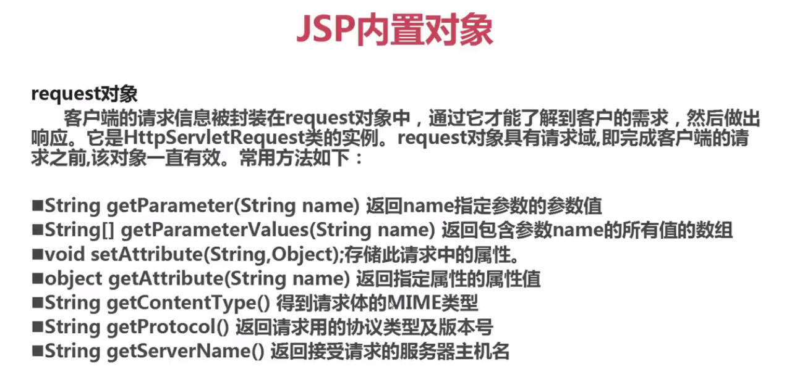
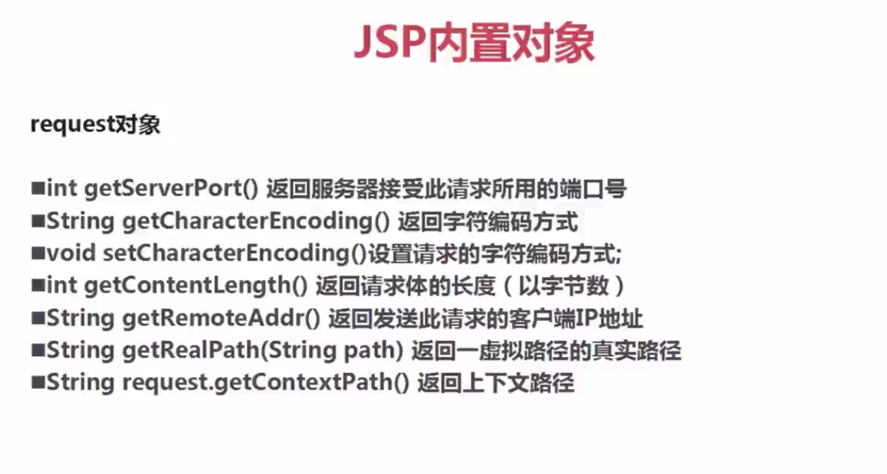
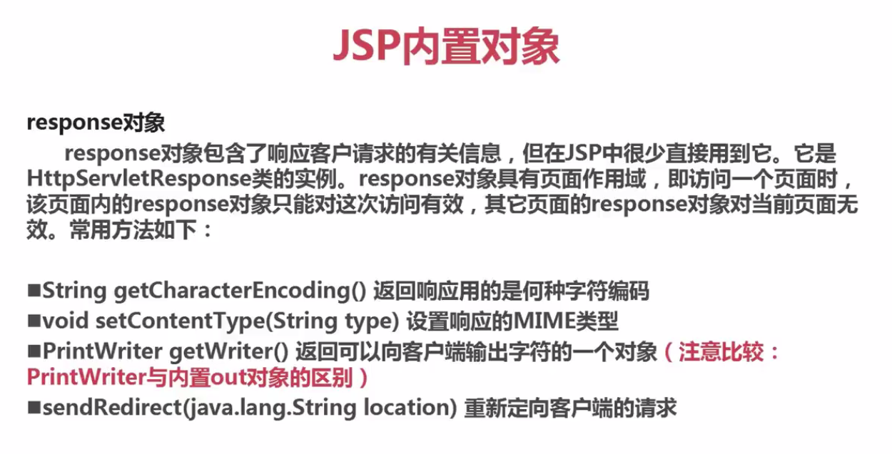
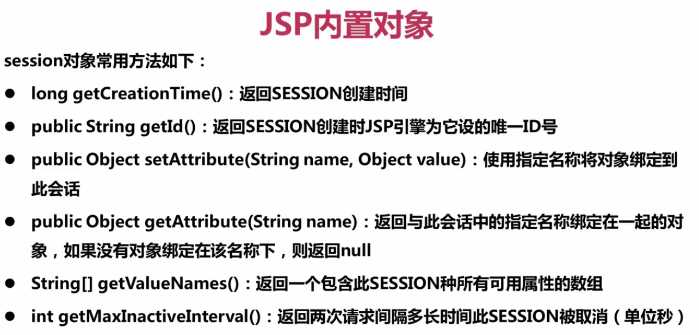
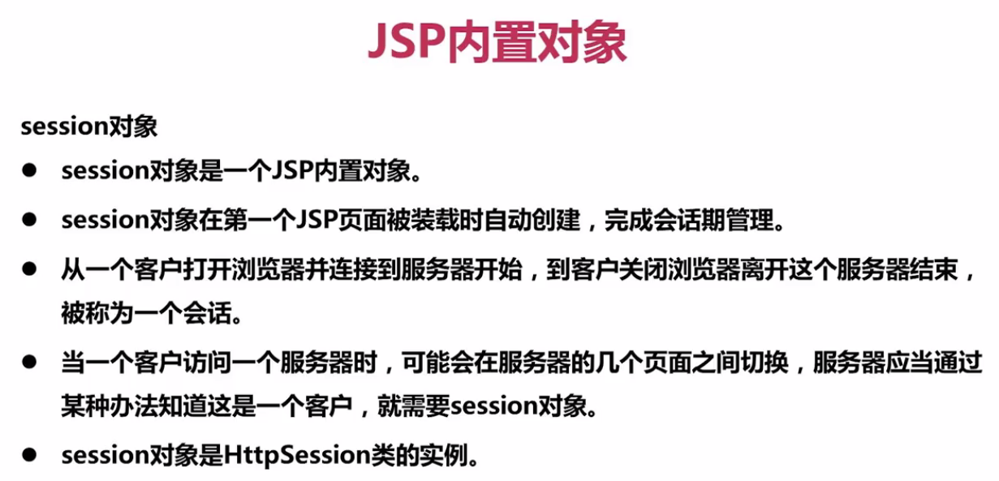
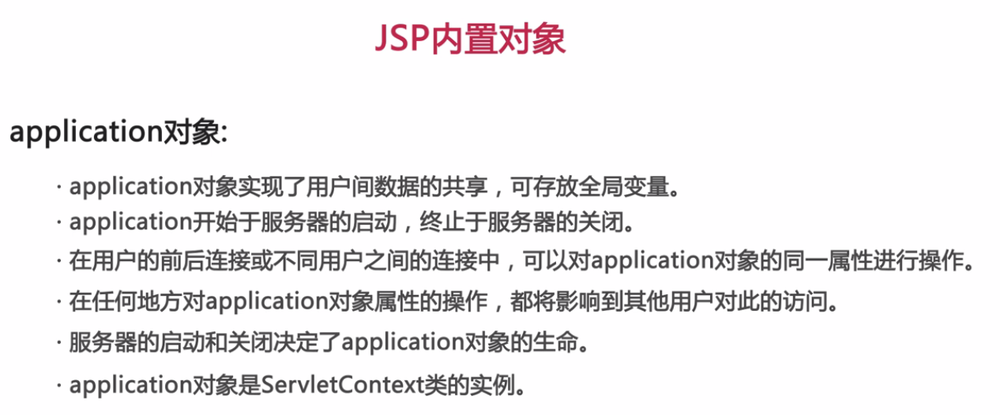
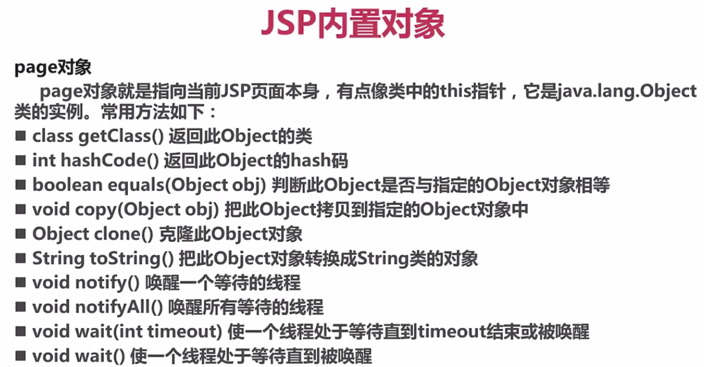

### Jsp九大内置对象

#### 1.out对象

继承自PrintWriter类，是javax.servlet.jsp.JspWriter类的实例，用来在response对象中写入内容。  
主要方法：

#### 2.request对象

request对象是javax.servlet.http.HttpServletRequest类的实例。每当客户端请求一个Jsp页面时，Jsp引擎就会制造一个新的request对象来代表这个请求。request对象提供了一系列方法来获取HTTP信息头，包括表单数据，cookies，HTTP方法等等。

#### 3.response对象

response对象包含了响应客户请求的有关信息，response对象是javax.servlet.http.HttpServletResponse类的一个实例。就像服务器会创建request对象一样，它也会创建一个客户端响应。  response对象定义了处理创建HTTP信息头的接口。通过使用这个对象，可以添加新的cookie或时间戳，还有HTTP状态码等等。  response对象具有页面作用域，即访问一个页面时，该页面内的response对象只能对这次访问有效，其他页面的response对象对当前页面无效。

#### 4.session对象

#### 5.application对象

application对象直接包装了servlet的ServletContext类的对象，是javax.servlet.ServletContext 类的实例。这个对象在JSP页面的整个生命周期中都代表着这个JSP页面。这个对象在JSP页面初始化时被创建，随着jspDestroy()方法的调用而被移除。通过向application中添加属性，则所有组成您web应用的JSP文件都能访问到这些属性。

#### 6.page对象

